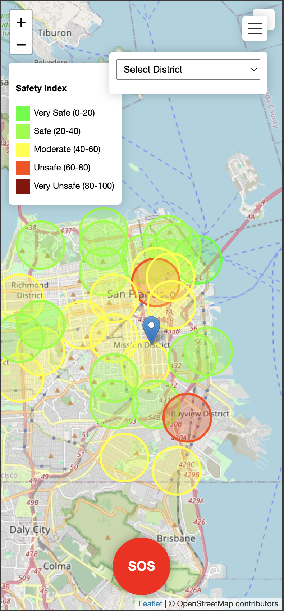

# safeCT
This project was made for hack 4 humanity hackathon.

## Overview
SafeCT is an innovative application designed to enhance urban safety by providing real-time crime data and location-based alerts. With rising crime rates making city navigation stressful, SafeCT empowers users with the tools and information they need to make informed decisions about their surroundings.

## Problem Statement
Navigating city streets can be daunting due to increasing crime rates. SafeCT aims to solve this issue by offering a comprehensive safety assessment of different areas, enabling users to travel with confidence.

## Key Features
### 1. **Interactive Crime Heatmap**
- Displays a transparent crime index across San Francisco.
- Provides a visual representation of crime trends, allowing users to identify high-risk areas instantly.

### 2. **Crime Score Index**
- Assigns safety scores to different locations based on crime data and trends.
- The heatmap updates dynamically, ensuring users have access to the latest safety insights.

### 3. **Quick Access S.O.S Button**
- Can be activated by briefly holding the button.
- Triggers a loud alert siren on the user’s device.
- Notifies law enforcement and emergency contacts instantly.

### 4. **Location Alert System**
- Tracks users' locations in real time.
- Sends alerts when approaching high-risk areas.
- Provides users with the option to contact emergency contacts or request SafeCT assistance.

## Future Plans
### **Neighbor Alert System**
- When a distress signal is activated, SafeCT will notify law enforcement and also alert other users within a five-mile radius.

### **AI-Based Distress Audio Detection**
- Implements AI technology to analyze ambient sounds and detect distress signals.
- Functions as an automatic safety measure in situations where the user is unable to manually access their phone.

### **Expansion & Enhancements**
- Expand SafeCT’s platform to cover more cities and regions.
- Strengthen partnerships with law enforcement agencies to improve response times and efficiency.
- Introduce new safety tools and analytics for a more robust security experience.

## Mission
SafeCT envisions a future where safety is a given, not a concern. By leveraging technology, we aim to empower communities and ensure a secure, informed, and connected environment for everyone.

# watch the demo 

*Designed by Yuvraaj Bhatter in California.*
